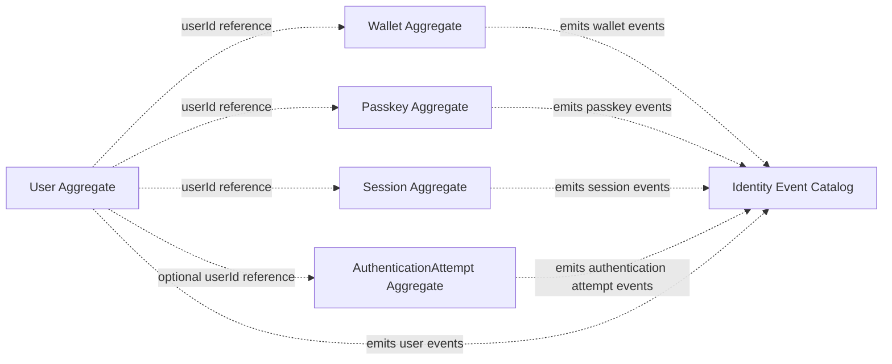

# Identity Aggregate Dependency Diagram

Status: Final

## Boundary Rule

Identity aggregates do not mutate each other directly. Cross-aggregate coordination happens outside aggregate methods through application services, repositories, and domain events.

## Diagram

## Notes

- References are identifiers only, not aggregate object dependencies.
- No aggregate owns another aggregate.
- The diagram documents the existing Identity v2 model only.
